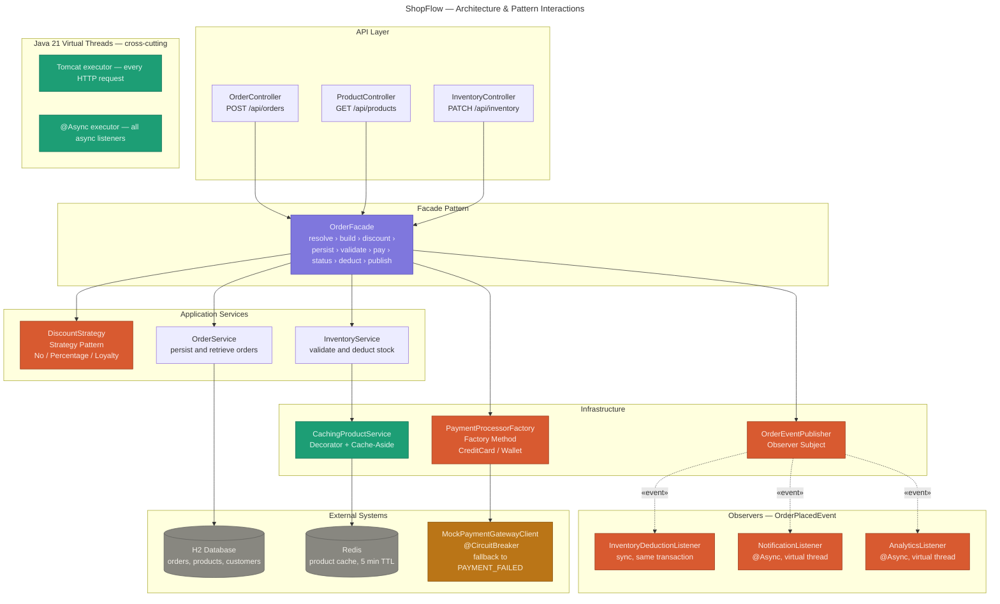

# ShopFlow — E-commerce Backend Capstone

A standalone Spring Boot backend that demonstrates the transition from **working code to engineered software**. Every architectural decision — from class names to package structure — is driven by a specific design principle or pattern requirement.

---

## Table of Contents

1. [Business Domain](#1-business-domain)
2. [Tech Stack](#2-tech-stack)
3. [Quick Start](#3-quick-start)
4. [API Reference](#4-api-reference)
5. [Pattern Inventory Table](#5-pattern-inventory-table)
6. [SOLID Principles](#6-solid-principles)
7. [Performance: Virtual Threads & Caching](#7-performance-virtual-threads--caching)
8. [Resilience: Circuit Breaker](#8-resilience-circuit-breaker)
9. [Architecture Diagram](#9-architecture-diagram)
10. [Project Structure](#10-project-structure)

---

## 1. Business Domain

**E-commerce — Order & Inventory Management**

ShopFlow allows customers to browse a product catalogue, place orders, and have stock adjusted automatically. The system handles:

- Product catalogue with Redis caching
- Multi-tier customer discounts (Standard / Premium / VIP)
- Payment processing via a mock external gateway protected by a circuit breaker
- Event-driven side-effects (stock deduction, notifications, analytics) via the Observer pattern
- Warehouse stock management with automatic cache eviction

---

## 2. Tech Stack

| Concern | Technology |
|---|---|
| Language | Java 21 |
| Framework | Spring Boot 3.3 |
| Persistence | Spring Data JPA + H2 (in-memory) |
| Cache | Spring Data Redis + Lettuce |
| Resilience | Resilience4j 2.2 |
| Concurrency | Java 21 Virtual Threads |
| Build | Maven |
| Utilities | Lombok |
| Observability | Spring Boot Actuator |

---

## 3. Quick Start

### Prerequisites

- Java 21+
- Maven 3.9+
- Docker (for Redis)

### 1 — Start Redis

```bash
docker run -d --name shopflow-redis -p 6379:6379 redis:7-alpine
```

### 2 — Run the application

```bash
git clone <your-repo-url>
cd shopflow
mvn spring-boot:run
```

The application starts on **`http://localhost:8080`** with H2 seeded automatically.

### 3 — Explore the data

| Tool | URL |
|---|---|
| H2 Console | http://localhost:8080/h2-console |
| Actuator Health | http://localhost:8080/actuator/health |
| Circuit Breaker State | http://localhost:8080/actuator/circuitbreakers |

H2 JDBC URL: `jdbc:h2:mem:shopflowdb` · User: `sa` · Password: _(empty)_

### 4 — Place a sample order

```bash
# 1. Get all products (note the IDs)
curl http://localhost:8080/api/products

# 2. Get all customers (note the IDs)
curl http://localhost:8080/api/customers   # if you add this endpoint, or check H2 console

# 3. Place an order
curl -X POST http://localhost:8080/api/orders \
  -H "Content-Type: application/json" \
  -d '{
    "customerId": "<customer-uuid>",
    "paymentType": "CREDIT_CARD",
    "shippingAddress": {
      "street": "123 Main St",
      "city": "Baku",
      "postalCode": "AZ1000",
      "country": "Azerbaijan"
    },
    "items": [
      { "productId": "<product-uuid>", "quantity": 2 }
    ],
    "notes": "Leave at the door"
  }'
```

### Triggering the Circuit Breaker

Set `shopflow.gateway.failure-rate-percent=60` in `application.properties`, restart, and send 10+ orders. After enough failures the circuit opens and subsequent orders return `PAYMENT_FAILED` instantly (no gateway wait).

---

## 4. API Reference

| Method  | Path                                | Description                   |
|---------|-------------------------------------|-------------------------------|
| `GET`   | `/api/customers`                    | All customers                 |
| `GET`   | `/api/customers/{id}`               | Single customer               |
| `POST`  | `/api/customers`                    | Create a new customer         |
| `GET`   | `/api/products`                     | All products (cached)         |
| `GET`   | `/api/products/{id}`                | Single product (cached)       |
| `GET`   | `/api/products/category/{cat}`      | Products by category (cached) |
| `GET`   | `/api/products/in-stock`            | In-stock products (cached)    |
| `POST`  | `/api/orders`                       | Place a new order (full flow) |
| `GET`   | `/api/orders/{id}`                  | Order detail with line items  |
| `GET`   | `/api/orders/customer/{customerId}` | All orders for a customer     |
| `PATCH` | `/api/inventory/{productId}/stock`  | Set absolute stock level      |
| `GET`   | `/api/inventory/{productId}/stock`  | Live stock count (DB read)    |

All error responses share a uniform shape:

```json
{
  "status": 404,
  "error": "PRODUCT_NOT_FOUND",
  "message": "Product not found with id: ...",
  "timestamp": "2025-05-15T10:30:00Z"
}
```

---

## 5. Pattern Inventory Table

### Creational Patterns

| Pattern | Class(es) | Reason |
|---|---|---|
| **Builder** | `Order`, `Order.Builder` | `Order` has many optional fields (items, discount, notes, address). A fluent builder enforces required fields at construction time and makes caller intent readable. The `private` constructor guarantees every `Order` is built through the validated builder path. |
| **Factory Method** | `PaymentProcessorFactory`, `CreditCardProcessor`, `WalletProcessor`, `PaymentProcessor` (interface) | Decouples payment-type selection from the order flow. The factory auto-discovers all `PaymentProcessor` beans via Spring's list injection — adding a new payment method requires only a new `@Component` class. `OrderFacade` never imports a concrete processor. |

### Structural Patterns

| Pattern | Class(es) | Reason |
|---|---|---|
| **Facade** | `OrderFacade` | Hides a 9-step orchestration (customer resolution → item building → discount → persistence → stock validation → payment → status update → stock deduction → event publishing) behind a single `placeOrder(request)` method. `OrderController` is 3 lines long as a direct result. |
| **Decorator** | `CachingProductService` wrapping `ProductServiceImpl` | Adds Redis Cache-Aside behaviour to every `ProductService` method without modifying `ProductServiceImpl`. Both implement `ProductService`; `@Primary` routes injections to the decorator transparently. Controllers never know caching exists. |

### Behavioral Patterns

| Pattern | Class(es) | Reason |
|---|---|---|
| **Strategy** | `DiscountStrategy`, `NoDiscountStrategy`, `PercentageDiscountStrategy`, `LoyaltyDiscountStrategy`, `DiscountStrategyFactory` | Each customer tier maps to a different pricing rule. `OrderFacade` calls `factory.getStrategy(tier).calculate(subtotal)` — no `if/else` on tier anywhere in the flow. Adding a new tier means a new class; nothing existing changes. |
| **Observer** | `OrderEventPublisher`, `OrderPlacedEvent`, `InventoryDeductionListener`, `NotificationListener`, `AnalyticsListener` | Three independent side-effects (stock deduction, confirmation notification, metrics recording) are triggered by one event without `OrderFacade` knowing any of them exist. Adding a new side-effect is a new `@EventListener` class — the facade is never touched. |

---

## 6. SOLID Principles

### Single Responsibility Principle (SRP)

Every class in ShopFlow has exactly one axis of change:

| Class | Its one responsibility |
|---|---|
| `ProductServiceImpl` | Translating `ProductService` calls into JPA queries |
| `CachingProductService` | Redis cache-aside for product reads |
| `InventoryServiceImpl` | Stock validation, deduction, and cache eviction |
| `OrderServiceImpl` | Persisting and retrieving `Order` aggregates |
| `OrderFacade` | Sequencing the order placement flow |
| `GlobalExceptionHandler` | Mapping domain exceptions to HTTP responses |
| `OrderEventPublisher` | Wrapping Spring's event bus with a domain-aware API |

### Open/Closed Principle (OCP)

Three locations demonstrate OCP clearly:

1. **Adding a discount tier** — write a new `DiscountStrategy` implementation and add one entry to `DiscountStrategyFactory`. No existing strategy or facade code changes.
2. **Adding a payment method** — write a new `PaymentProcessor` `@Component`. `PaymentProcessorFactory` auto-discovers it. No factory code changes.
3. **Adding an order side-effect** — write a new `@EventListener` class. `OrderFacade` is untouched.

### Dependency Inversion Principle (DIP)

- Controllers depend on `ProductService` (interface), not `CachingProductService` (class)
- Processors depend on `PaymentGatewayClient` (interface), not `MockExternalPaymentGatewayClient` (class)
- `OrderFacade` depends on `InventoryService`, `OrderService`, `ProductService` — all interfaces

---

## 7. Performance: Virtual Threads & Caching

### Java 21 Virtual Threads

Configured in two places:

**`application.properties`** (Boot auto-configuration):
```properties
spring.threads.virtual.enabled=true
```

**`VirtualThreadConfig`** (explicit, visible wiring):
```java
// Every HTTP request runs on a virtual thread
protocolHandler.setExecutor(Executors.newVirtualThreadPerTaskExecutor());
```

**`AsyncConfig`** (for `@Async` listeners):
```java
return Executors.newVirtualThreadPerTaskExecutor();
```

When a virtual thread blocks on a Redis read, H2 query, or the 200 ms mock gateway latency, it is **unmounted from its carrier thread**. The carrier is immediately available for another request. This is the core throughput benefit: the application handles thousands of concurrent blocked I/O calls with a tiny carrier-thread pool.

### Redis Cache-Aside (Decorator pattern)

Every `ProductService` read goes through `CachingProductService`:

```
GET /api/products/{id}
  → CachingProductService.findById(id)
      → redis.get("product::{id}")
          HIT  → return immediately (no DB call)
          MISS → ProductServiceImpl.findById(id) [DB]
               → redis.set("product::{id}", product, TTL=5min)
               → return
```

Cache eviction is triggered by `InventoryService` after every stock mutation, keeping cached data consistent with the database.

**Cache keys:**

| Key | Content | TTL |
|---|---|---|
| `product::{uuid}` | Single product | 5 min |
| `product::all` | Full catalogue list | 5 min |
| `product::category::{name}` | Category subset | 5 min |
| `product::in_stock` | In-stock list | 5 min |

---

## 8. Resilience: Circuit Breaker

`MockExternalPaymentGatewayClient.charge()` is protected by Resilience4j:

```java
@CircuitBreaker(name = "paymentGateway", fallbackMethod = "fallbackCharge")
public PaymentResult charge(String paymentMethod, BigDecimal amount, String orderId)
```

**State machine:**

```
CLOSED ──(failure rate > 50% over 10 calls)──▶ OPEN
  ▲                                               │
  │                              wait 10 seconds  │
  │                                               ▼
  └──(3 probe calls succeed)── HALF-OPEN ◀────────┘
```

**Fallback behaviour:** when the circuit is open, `fallbackCharge` fires immediately (no gateway call) and returns `PaymentResult.failure("circuit open")`. `OrderFacade` transitions the order to `PAYMENT_FAILED` — the request returns a valid response, not a 500 error.

**Configuration** (in `application.properties`):
```properties
resilience4j.circuitbreaker.instances.paymentGateway.sliding-window-size=10
resilience4j.circuitbreaker.instances.paymentGateway.failure-rate-threshold=50
resilience4j.circuitbreaker.instances.paymentGateway.wait-duration-in-open-state=10s
```

---

## 9. Architecture Diagram



---

## 10. Project Structure

```
com.shopflow/
├── ShopFlowApplication.java
│
├── api/
│   ├── controller/
│   │   ├── OrderController.java
│   │   ├── ProductController.java
│   │   ├── InventoryController.java
│   │   └── GlobalExceptionHandler.java
│   └── dto/
│       ├── PlaceOrderRequest.java
│       ├── OrderResponse.java
│       ├── ProductResponse.java
│       ├── UpdateStockRequest.java
│       └── ApiErrorResponse.java
│
├── application/
│   ├── facade/
│   │   └── OrderFacade.java                    ← Facade pattern
│   ├── service/
│   │   ├── ProductService.java                 ← interface
│   │   ├── ProductServiceImpl.java
│   │   ├── InventoryService.java               ← interface
│   │   ├── InventoryServiceImpl.java
│   │   ├── OrderService.java                   ← interface
│   │   ├── OrderServiceImpl.java
│   │   ├── ProductNotFoundException.java
│   │   ├── OrderNotFoundException.java
│   │   ├── CustomerNotFoundException.java
│   │   └── InsufficientStockException.java
│   └── strategy/
│       ├── DiscountStrategy.java               ← Strategy pattern interface
│       ├── NoDiscountStrategy.java
│       ├── PercentageDiscountStrategy.java
│       ├── LoyaltyDiscountStrategy.java
│       └── DiscountStrategyFactory.java
│
├── domain/
│   ├── model/
│   │   ├── Order.java                          ← Builder pattern (inner Builder class)
│   │   ├── OrderItem.java
│   │   ├── Product.java
│   │   ├── Customer.java
│   │   ├── ShippingAddress.java
│   │   ├── OrderStatus.java
│   │   ├── PaymentType.java
│   │   └── CustomerTier.java
│   └── event/
│       └── OrderPlacedEvent.java               ← Observer pattern event
│
├── infrastructure/
│   ├── cache/
│   │   └── CachingProductService.java          ← Decorator pattern
│   ├── factory/
│   │   ├── PaymentProcessor.java               ← Factory Method interface
│   │   ├── PaymentProcessorFactory.java        ← Factory Method creator
│   │   ├── CreditCardProcessor.java
│   │   ├── WalletProcessor.java
│   │   └── PaymentResult.java
│   ├── gateway/
│   │   ├── PaymentGatewayClient.java           ← interface
│   │   └── MockExternalPaymentGatewayClient.java  ← Circuit Breaker
│   ├── observer/
│   │   ├── OrderEventPublisher.java            ← Observer subject
│   │   ├── InventoryDeductionListener.java     ← Observer #1 (sync)
│   │   ├── NotificationListener.java           ← Observer #2 (async)
│   │   └── AnalyticsListener.java              ← Observer #3 (async)
│   └── repository/
│       ├── ProductRepository.java
│       ├── OrderRepository.java
│       └── CustomerRepository.java
│
└── config/
    ├── AsyncConfig.java                        ← @EnableAsync + VT executor
    ├── VirtualThreadConfig.java                ← Tomcat VT customizer
    ├── RedisConfig.java
    └── DataSeeder.java
```

---
